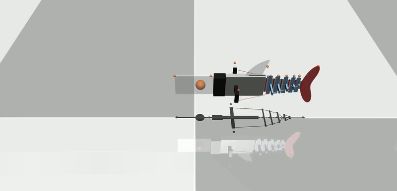

# Underwater Robot Fish Simulation in MuJoCo

Just creating fish. [Website](https://srl-ethz.github.io/website_fishsim/). [Paper](http://arxiv.org/abs/2602.23283).


## Geometry

The XML file that MuJoCo uses to generate the scene for the tendon-driven fish robot can be found in `Geometry/`. We have an example `tendonFish.xml`, which was auto-generated using the `auto_tendonFish.py` script. This script contains the function to automatically generate scenes with arbitrary number of robots, shape of robots, material/fluid parameters. These are configured in the SYSTEMPARAMETERS that are passed to the `generate_xml` function.

```python
from Geometry.auto_tendonFish import generate_xml, SYSTEMPARAMETERS

SYSTEMPARAMETERS["fluidCoef"] = [0.4, 7.79, 2.81, 3.84, 0.27]
generate_xml(SYSTEMPARAMETERS, "Geometry/exampleFish.xml")
```


## Video Marker Tracking

We provide the OpenCV code to extract marker locations from videos, exporting them to a CSV file which can be later used for defining a sim-to-real metric. The script is `track_bbox.py`, which uses the CSRT algorithm to track bounding boxes the user selects over time. The start and end frame are given, as well as the number of markers to track. The following command loads the video `Videos/f1_75.mp4`, lets the user choose 9 marker bounding boxes from frame 0, and tracks them from frame 0 to frame 300:

```bash
python track_bbox.py -f Data/f1_75.mp4 -n 9 -s 0 -e 300
```

An example of how these markers look overlayed on the video clip:
<p align="center">

</p>


## Data

We provide the tracked markers in the `Data/` folder, but users can also download the original videos and track the markers from scratch. The videos are found in: [Google Drive](https://drive.google.com/drive/folders/1bM4Kjv0C_C5ZQyzxJUkwOnjJE2mTtik9). `f1_25.mp4` implies the fish swimming at a constant motor angular velocity of 1.25Hz.


## Simulation Environment

We provide a simple function to run a simulation with given system parameters to collect a log with metrics. This function is found in `_simulate.py` (in addition to various control signals), where a simple example of a fish robot simulation can be called with:

```python
from _simulate import sim_fish

log = sim_fish(systemParameters, SineSignal(frequency=freq), SIMTIME, VIDEOFPS)
```

Alternatively, if rendering is desired, `run_sim.py` can be called to save an output video as well as plots using given system parameters.

<p align="center">

</p>


## System Identification

With the above data gathered, we can optimize the simulation actuation and fluid parameters to match the experimental markers. We can run the following script:

```bash
python opt_sysid.py --optType act -f f1_00 f1_75
```

This above command will run the actuation optimization to find optimal frequency and time offset to match the markers located in `Data/Markers/rotatedMarkers_f1_00.csv` and `Data/Markers/rotatedMarkers_f1_75.csv`. The output will be the trajectory of the optimal simulated markers compared to the real markers in `Outputs/`, and the optimization result will be stored in `Data/Optimization/act_<file>.yml`

Once the actuation optimization has been run, the fluid coefficient optimization can be run as well. Simply change the `optType` to `fluid`. Now 5 fluid parameters will be optimized on the given rotated marker datasets, and store similar outputs as for actuation optimization.

The baseline is also implemented within this SysId Python file, where the option `--optType ebt` will fit EBT parameters to whichever marker files are given. The output will store a `.yml` file with the parameters in `Data/Optimization`.


## Evaluation

We can evaluate the optimized fluid parameters, as well as the optimized actuation, on a wider range of frequencies for forward swimming cruising speed. 

```bash
python test_freq.py
```

Here all frequencies will be run in simulation using the optimized fluid coefficients in `Data/Optimization/fluid.yml`, and the actuation parameters in the same folder. The EBT baseline will be run as well, and the comparison between all methods with the real data will be plotted in `Outputs/`.


## Reinforcement Learning

Now the pipeline is ready for training reinforcement learning agents. We define our reward as a target tracking reward, and have the position of the target randomized. This agent can be trained by running 

```bash
python train_rl.py
```

Where the user can define various parameters, such as network architecture. We use `opt_hyperRL.py` to run a hyperparameter sweep using Weights and Biases to find the optimal learning setup for our target tracking robot fish.

Evaluation on various tracking (such as the circle trajectory) are run with `test_RLtraj.py`. 


## Aquarium

Run:
```bash
python run_passive_aquarium.py
```
